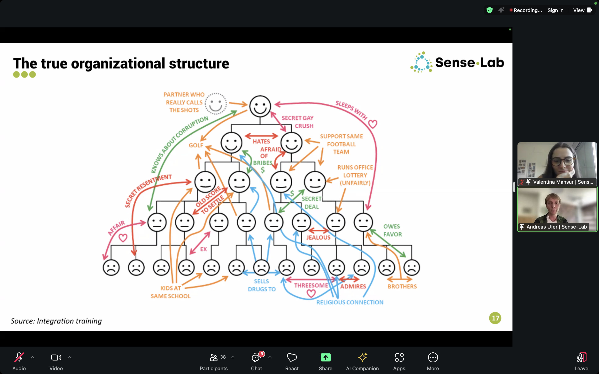

+++
title = 'Correspondence'
date = 2024-07-02T12:00:00+01:00
authors = ["Xavier Snelgrove"]
+++

Today's reflection is brought to you from a library in the Kreuzberg neighbourhood in Berlin. It's been a couple weeks since my last reflection, and in that time there's been some research movement, with talks and conferences and conversations, so there's material to process.

I attended my friend [Amanda Zamparo's](https://www.amandazamparo.com/) conference on "[Reimagining the future of work](https://www.canva.com/design/DAF-e_cGu7U/BdQNcVFcQI6W4Vt4I86MSw/edit)", online across three days. A strong theme across their sessions, which vibes well with where my research has been heading, is in understanding organizations first and foremost through the modes of relating.

The Brazilian consultancy [Sense-Lab](https://www.eng.sense-lab.com/) shared how they think about organizations as networks of conversations, and had this fun image which shows the "true" network of relationships that constitute an organization overlayed over a formal hierarchical org chart.

This mirrors well how I've been thinking about the nature of research. It is first and foremost a collection of conversations between researchers and each other, between researchers and the public, and in the case of the empirical sciences between researchers and the world. This is why I've been thinking about the conversations between us in the fellowship as a (the?) crucial pillar of the work.

In exploring this idea I have learned more about the history of the scientific revolution, and in particular the narrative that it was born out of informal networks of correspondence (see the [Invisible College](https://en.wikipedia.org/wiki/Invisible_College) and the [Republic of Letters](https://en.wikipedia.org/wiki/Republic_of_Letters)) international and asynchronous, but rooted in "IRL" relationships and salons. Only later were these correspondence practices formalized and institutionalized into the modern systems of journals, conferences, and peer review via the founding of the Royal Society.

I might summarize the insight here as **the atomic unit of research is correspondence**, and it immediately demands that my work continue *as* correspondence. Certainly these reflections are a step in that direction, but my commitment is to start a number of explicit pair-wise research correspondences with folks based on a sense of a shared resonance and the creative potential of the correspondence.

My encouragement to my cohort is to do the same, and certainly some of those dialogues can be with me, but I think finding the people whose correspondence brings out the research you are trying to create will be a key part of your fellowship journey. These relationships will transcend any formal research container we might create, and will have their own momentum that draws out the work.

Spencer Chang, who I've been meaning to interview as part of my research, muses in a recent newsletter on [being an in(ter)dependent researcher](https://spencerchang.substack.com/p/opening-yourself-to-support). There is much resonance with his thinking and my own:

> Every day of this "independent" life further cements my belief that the network (as in [mycelium](https://www.nationalforests.org/blog/underground-mycorrhizal-network)) is everything. Everything I'm able to accomplish is made possible by someone else. I've started to depart from "independent" as a classifier and reaching instead for "indie" to distinguish myself from being supported through traditional employment at a company.
> ...
> Maybe we could acknowledge them in our very titles? Maybe we could be "in(ter)dependent" (from [Marcel Goethals](https://twitter.com/wolkenmachine?lang=en)) artists, researchers, engineers, technologists, and creatives?

I gave a talk on this theme for Toronto Learning Night organized by my friend [Jessica Fan](https://www.jessicafan.ca/). (the other aspect was on the inherent unmeasurable ineffability of the work, which perhaps I can expand on in a future post). In the infinite ouroboros meta-nature of this inquiry, that talk was itself an investigation on the nature of research, and about another kind of dialogue, that between a researcher and "the public". A talk to a specific group at a specific time and place still seems more contextual and relational than the "generic blog post / newsletter" which I'm finding hard to imagine writing for my work (who would it be to? How would I connect with them?)

I was happy with how the talk went —  It was validating to see how the topic ("creating prosocial communities of teaching, learning and research") resonated with the audience and it sparked some good conversations which will further the work. As part of this summer fellowship we should create more spaces to present our work, perhaps we can have a micro-conference at 1rg. I would love to see how the rest of you start to weave your work into narratives.

***

*Xavier's research reflections. [Previous reflection]().*